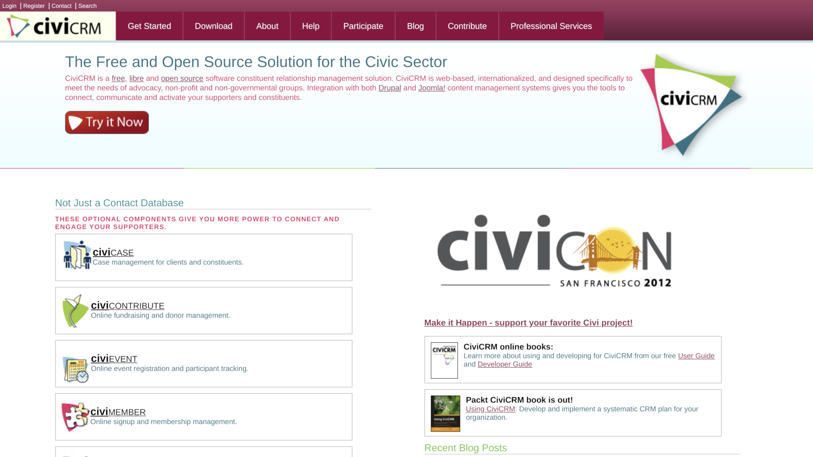

# Talk to CiviCRM

[Michael McAndrew](mailto:michaelmcandrew@thirdsectordesign.org), [Third Sector Design](https://3sd.io)

-

# Aims of the talk

- Demo CiviCRM Dialogflow
- Tell the story behind it
- Draw out threads
- & explain jargon

=

# A quick history

Note: people might think I'm obsessed with chatbots, conversational interfaces, etc.

-

## How did we get here?

**SMS Conversation**

- Built in 2012 for Future First
- Engage young people via SMS
- Automate conversations
- Worked nicely but a bit primitive

Note:

2012: "Young people don't use email any more"

2019: It's complicated - lots of people use lots of different platforms

-

## Natural language is hard  <small>esp. for computers</small>

<large> I spread the cloth on the table  in order to protect <a href="https://cs.nyu.edu/faculty/davise/papers/WinogradSchemas/WSCollection.html">it</a>  </large>

Note:

We've all had crummy experiences with NLP. But we've all had surprisingly good ones. Google offers its NLP as a service

-

Natural Language Processing as a service

-

## National Democratic Institute

- Funded three iterations since 2017
- Part of their <a href="https://www.ndi.org/demtools">dem-tools</a> suite
  <small><em>
  harnesses the power of free, open-source software to provide civic organizations, legislatures, and political parties with the capabilities to effectively engage 21st century citizens
  </em></small>
- Keen for it to be more widely used

Note: you learn by doing. We are really grateful for NDI for supporting us through this work. Probably didn't have to take three years, but it does help having some iterations and appreciating that you might not get it right straight away.

=

# Demo time

https://dialogflow.demo.3sd.io

Note:

Set timer for 5 mins

Key take aways

- Try and keep everything as simple as possible for the end user
- Declare what you want to do, and let Dialogflow fo the hard work behind the scenes
- Every intent in CiviCRM is an intent in Dialogflow
- Dialogflow takes care of collecting the info, and tell CiviCRM when it is ready
- Developers can add intent types

Questions?

-

## Intents and fulfilment

Conversations happen like this...

1. Identify the intent
2. Collect info required to fulfil the intent
3. Ask CiviCRM to fulfil the intent

=

# Learnings

-

## Building blocks are not  the answer to everything

Note:

Developers love building blocks

Not obvious how to get assemble blocks

To do it well, you need experience and knowledge

Lots of ways to go wrong.

An instruction book would be handy

-

## SMS conversation configuration

Note:

In the SMS conversation extension, users had to think a lot.

In Dialogflow CiviCRM, you need close to zero experience in NLP

We make things simpler by focusing on the end result.

-

# Developer vs. users

Do we have to choose?

Note:

We made it easy for users (IMHO) but what about developers?

What do developers want?

-

## Developer friendliness

- A nice API 
  <small><em>some people like building blocks</em></small>
- Developer documentation 
  <small>https://docs.civicrm.org/dialogflow/en/latest/dev/api/</small>
- We like developers

Note:

NDI want it to be adopted, hence they wanted to make it dev friendly.

You can create new intent types.

- General - we accept
- Specific - keep them in a content type

-

## Layers

Keep everyone happy with layers

- **user layer** - easy to create intents
- **power user layer** - use Dialogflow tools
- **developer layer** - create intent types

Note:

The result of designing for different user needs

We thought about developer and user needs seperately and in parallel and it dramatically changed our approach.

Developer friendliness can't be at the expense of user friendliness

SMS conversation one solution for both (too complex for users, too simple for developers).

-

## Iterations

- Three previous extensions
- &pound;6,800 for this MVP
- &pound;10,200 (approx) in the pipeline 
  <small>
  developer experience, monitoring, usability, new intent types, features, etc.
  </small>

Note:

Good to be open about price

Couldn't have done it without previous iterations.

It is only an MVP

We wanted to take advantage of technologies that didn't exist last time

NDI are keen to need wider needs

-

## The painful stuff

- Privacy 
  <small>edge devices for NLP / https://voice.mozilla.org</small>
- Configuring _some_ integrations 
  <small>Extreme example: WhatsApp's API is run by Twilio but WhatsApp business authorisation happens via the Facebook for Business platform. To integrate WhatsApp with CiviCRM you connect WhatsApp to Twilio and Facebook, authorise WhatsApp with Facebook, connect Twilio to Dialogflow, and Dialogflow to CiviCRM (yawn).</small>

-

## The future

- Speech
- A back end interface? 
  <small><em>Call Rose Langigan 
  Who are our top 5 donors? 
  Create a new event
  </em></small>
- More intent types (survey, events)
- Your contributions welcome

=

# Custom development tips

- Sometimes it's better not to
- Think about maintenance
- Contribute to core instead?
- It's OK sometimes
- Talk to others

Note:

- Customisations come in many shapes and sizes
- Compare ongoing cost of maintainence vs one of cost of core contribution
- Compare people with lots of customisations to people who don't have any

=

# Thanks

Future First - getting it started

Matt Wire - earlier versions

Carlos Capote - this version

NDI (<a href="https://twitter.com/nditech">@NDItech</a>) - continued commitment

Note: If you like the look of this, feel free to tweet NDI and say thank you

=

# Talk to people

Note:

That's the reason we are here

Watch

If you have been before, make the effort to talk to people that are new

If you are new and want to be sign posted, Rich, Rose, Heather, Craig are great people to talk to to get sign posted.
