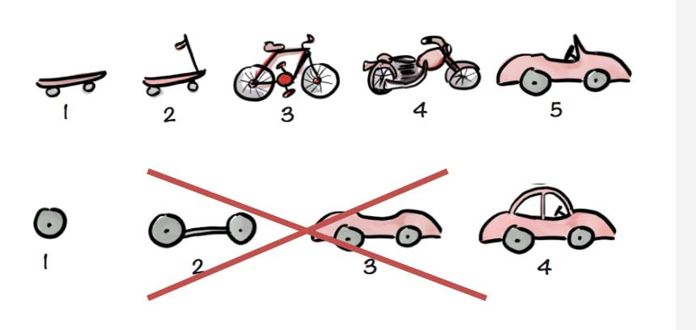

# Website integration case study: ARCO

[Katie Draper](mailto:katiedraper@arcouk.org), [ARCO](https://arcouk.org)

[Michael McAndrew](mailto:michaelmcandrew@thirdsectordesign.org), [Third Sector Design](https://3sd.io)

Note:

Katie not here, but would have liked to have been.

Always good to get user perspective / experience / side of the story

Users: I encourage you to share your story

Specifics are Drupal, generality is for WordPress too

-

# Session aims

Bring it to life through real examples

Presume no knowledge

Answer your questions

Have a conversation

Start simple and get more sophisticated as we go

Note:

Try and convey as much as possible through looking at examples

Help me: if anything isn't clear, it is my fault. I must have forgotten to say something. Ask me to explain.

If you have something to contribute / clarify, please do

-

# About [ARCO](https://arcouk.org)

Represent members

Shape government policy

Promote the retirement community model

Note:

Actually really important and exciting work.

Michael Voges is really passionate about it

-

# ARCO and CiviCRM

Membership [sign up](https://www.arcouk.org/join) and renewal, and member resources

[Event registration](https://www.arcouk.org/events) and management

[Maps](https://www.arcouk.org/find-a-retirement-community), directories, [member promotion](https://www.arcouk.org/)

Case work: assessment, accreditation and complaints

Note:

ARCO is a great match for CiviCRM. It exercises a lot of what CiviCRM does really well.

CiviEvent, CiviMember, CiviCase, Views, Webforms

-

# The approach

Out of the box > 'Powertool' Extensions > Custom code

-

# A simple view

[The member banner](https://www.arcouk.org)

Entity to display

Fields to display

Filter criteria

Sort criteria

Note:

Edit the view

Look at some contacts in the back end

-

## Exposed filters

[The supplier directory](https://www.arcouk.org/suppliers-directory)

Note:

Select Technology

Edit the view

Look at the exposed filter

-

## Different entities

[Upcoming events](https://www.arcouk.org/events)

Contacts, memberships, events, activities, contributions, etc.

-

## Maps

[Find a retirement community](https://www.arcouk.org/find-a-retirement-community)

A view with some custom code

Note: ask people if they have any questions about views

What else would you like to do with views?

-

# Views vs. custom code

Point and click not _necessarily_ easy to use.

The happy path

Note:

In my 10+ years, I'm not sure I have ever had a client tweak a view.

Ask question: if you can't tweak them yourself, why use views? why not just write from scratch?

Helps you to stay on the happy upgrade path.

-

# A simple webform

webform_civicrm = webform + civicrm

[Sign up to our newsletter](https://www.arcouk.org)

Note:

By way of an intro: CiviCRM has lots of out of the box forms (event reg. contribution). But sometimes you want more control. Want to build your own form.

Webforms exist independently of CiviCRM. Webform CiviCRM joins webform and CiviCRM.

-

# Multiple contacts and entities

[Join ARCO](https://www.arcouk.org/user/join)

Multiple related contacts

Related entities (organisational membership and activity)

-

# Multi-page forms

[Partner registration](https://www.arcouk.org/user/partner-registration)

Note:

What else would you like to do with a webform?

-

# Custom code

_A little can go a long way_

Joining everything up with a [dashboard](https://www.arcouk.org/user)

Brings together multiple webforms

Analyses state and suggests the next step

Loosely coupled

Note:

Pre-filling with contacts via query parameters

-

# The WordPress slide

Webform --> Caldera Forms

Views --> [CiviCRM Content Views](https://github.com/mecachisenros/content-views-civicrm) \*

_\* A proof of concept_

-

# A work in progress

Note:

Tackle the simplest highest impact stuff first

With membership registration, we did the simplest stuff first

We still have lots of work to do.

The organisation is constantly changing.

It is a service not a product

-

# Collaboration

Pilot: North Bridge Digital

Hosting: MJW consulting

Support, training and development: Third Sector Design

Note: Don't sign a one year contract. Shop around

-

# Thank you!

(we are hiring)
