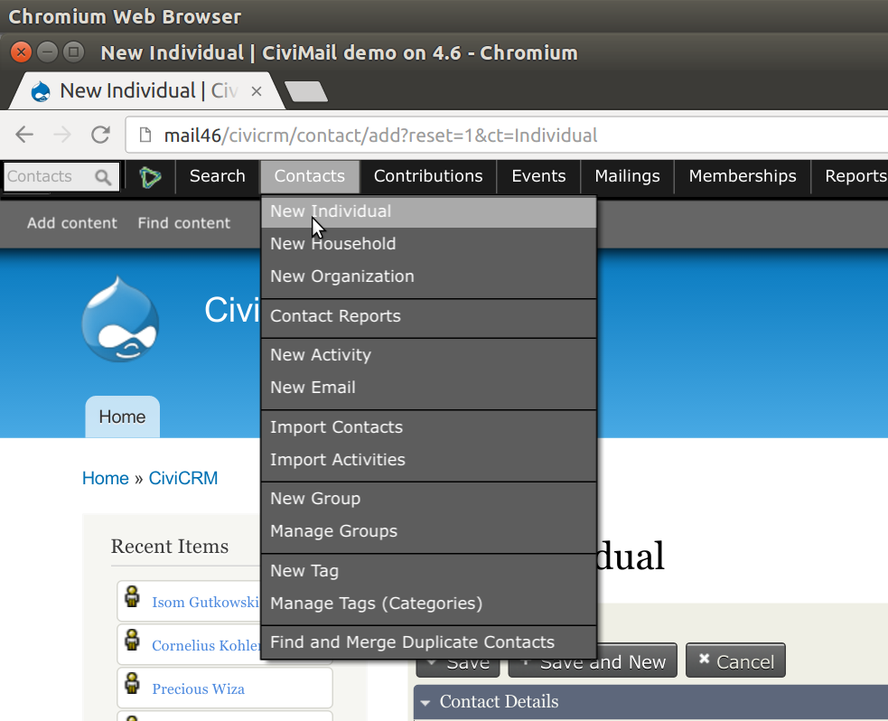

=

# Populate a site with data

=

# Populate a site with randomly generated data

=

For example
# How to quickly<br />add 100 contacts<br />and 500 contributions?

=

# Why?

- Demo data (generic and project specific)
- Stress testing (of code and infrastructure)
- Probably other uses too!

=

# Via the UI[?](http://pop)



=

# Via the API?

```php
<?php
while($x < 100){
  $result = civicrm_api('Contact', 'create', (array('first_name' => 'Joe', 'last_name' => 'Bloggs')));
  $X++;
  if(!$result['is_error']){
    $result = civicrm_api('Contribution', 'create', (array('total_amount' => '100')));    
  }
}
```

=

# Via the API?

```php
<?php
while($x < 100){
  $result = civicrm_api('Contact', 'create', (array('first_name' => 'Joe', 'last_name' => 'Bloggs')));
  $X++;
  if(!$result['is_error']){
    $result = civicrm_api('Contribution', 'create', (array('total_amount' => '100')));    
  }
}

// Add random data generator (and many other)
// helper functions here!

```

=

# Via Pop

```yml
- individual: 10
- contribution: 50
```

=

# Demo time

=

# Pop syntax...

=

## A list of entities

```yml
- individual: 10
- contribution: 50
- event: 3
- participant: 200
```

=

## Can define fields

```yml
- contribution: 50
  fields:
    total_amount: 100
```

=

## Can add child entities

```yml
- contact: 50
  children:
  - contribution: 3
```

vs

```yml
- contact: 50
- contribution: 3
```

=

# Generate fake details

## f.[fakerMethod]

```yml
fields:
  first_name: f.firstName
  last_name: f.lastName
```

https://github.com/fzaninotto/Faker

=

## Entities have sensible defaults


```
fields:
  first_name: f.firstName
  last_name: f.lastName
children:
  - email: 0-3
  - phone: 0-2
  - address: 0-2
```
Default individual

=

## Can make choices

```yml
- contribution: 5
  fields:
    total_amount:
      50: 1
      10: 9
```

=

## Can choose random entities

```yml
- contribution:
  fields:
    financial_type_id: r.financial_type
```

=

# Pop builds on

- CV (command line interface)
- CiviCRM's API

=

# Find it at
https://github.com/michaelmcandrew/cv/tree/pop

and soon in cv

=

## Michael McAndrew
## Third Sector Design
